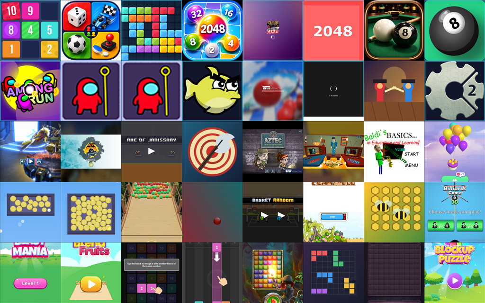
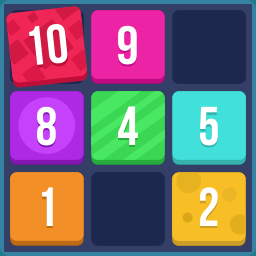
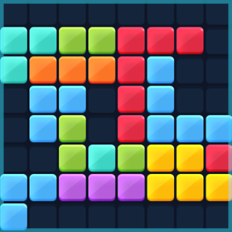
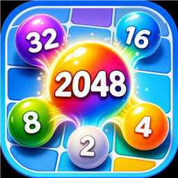

# MADStudio Game Hub


Một arcade showcase chạy bằng GitHub Pages, dùng để giới thiệu game HTML có thể chơi ngay trên trình duyệt và các sample Unity phục vụ portfolio. Hub là site tĩnh, người xem chỉ cần mở trang, duyệt card game, rồi bấm chơi trực tiếp.

Chơi trực tiếp tại: [https://hoatv2211.github.io/mad-game-hub-shared/](https://hoatv2211.github.io/mad-game-hub-shared/)

English version: [README.md](README.md)

## Showcase

MADStudio Game Hub gom hai nhóm nội dung chính vào một portfolio công khai:

- **40 hub game có thể chơi trực tiếp** trong `docs/hubgames/`, mỗi game có file `index.html` riêng.
- **Sample Unity học tập** có link source, demo, ghi chú kỹ thuật, và trang chi tiết dạng portfolio.
- **Sẵn sàng publish bằng GitHub Pages** với HTML, CSS, JavaScript, JSON, và asset tĩnh.
- **Catalog có hình ảnh** với icon vuông cho từng game để duyệt nhanh hơn.

## Gallery



Contact sheet này giúp người xem lướt nhanh màu sắc và phong cách của catalog trước khi mở hub để chơi.

## Mở Hub

Online:

```text
https://hoatv2211.github.io/mad-game-hub-shared/
```

Chạy local:

```bat
run.bat
```

Sau đó mở:

```text
http://localhost:13000/
```

Cấu hình GitHub Pages khuyên dùng:

```text
Branch: main
Folder: /docs
```

## Hub Game Nổi Bật

| Icon | Game | Play path |
| --- | --- | --- |
|  | 10 Ten! | `docs/hubgames/000001_10_Ten/index.html` |
|  | 2-3-4 Player Games | `docs/hubgames/000002_2-3-4_Player_Games/index.html` |
|  | 2024 Plus | `docs/hubgames/000003_2024_Plus/index.html` |
|  | 2048 Balls | `docs/hubgames/000004_2048_Balls/index.html` |
|  | 3D Russian Billiards | `docs/hubgames/000007_3D_Russian_Billiards/index.html` |

Danh sách đầy đủ được đọc từ [docs/data/hub-games.json](docs/data/hub-games.json). Mỗi entry giữ tên game, folder, đường dẫn chơi, và đường dẫn icon để trang hub render tự động.

## Showcase Unity

| Sample | Thể loại | Độ khó | Trọng tâm | Source | Demo |
| --- | --- | --- | --- | --- | --- |
| [Share001_Ludo](docs/Share001_Ludo.html) | Board Game | Beginner | Logic bàn cờ theo lượt, deterministic | [GitHub](https://github.com/hoatv2211/Share001_Ludo) | [Play](https://hoatv2211.github.io/Share001_Ludo/) |
| [Share002_PixelShooter3D](docs/Share002_PixelShooter3D.html) | Action Shooter | Intermediate | Di chuyển, combat loop, spawn enemy, scoring | [GitHub](https://github.com/hoatv2211/Share002_PixelShooter3D) | [Play](https://hoatv2211.github.io/Share002_PixelShooter3D/) |
| [Share003_AgeOfBattle](docs/Share003_AgeOfBattle.html) | Strategy / Battle | Intermediate | Unit waves, positioning, combat flow, progression | [GitHub](https://github.com/hoatv2211/Share003_AgeOfBattle) | [Play](https://hoatv2211.github.io/Share003_AgeOfBattle/) |

Metadata của phần Unity nằm ở [docs/data/games.json](docs/data/games.json). Source Unity vẫn ở repo ngoài để repo này gọn, nhẹ, và tập trung vào showcase.

## Người Xem Sẽ Thấy Gì

- Màn hình đầu kiểu arcade launcher retro.
- Catalog game có search và sort.
- Icon vuông giúp nhận diện game nhanh.
- Link chơi trực tiếp cho từng hub game.
- Card Unity sample có demo, source, trọng tâm học tập, và trang chi tiết.

## Cấu Trúc Chính

```text
mad-game-hub-shared/
  README.md
  README.VN.md
  run.bat
  docs/
    index.html
    assets/
      hubmad.png
      game-icons/
    hubgames/
      <game-folder>/index.html
    ShareNNN_GameName.html
    data/
      hub-games.json
      games.json
  tools/
    generate-game-icons.ps1
    generate-ai-game-icons.ps1
```

Quy ước format chi tiết nằm trong [docs/PROJECT_FORMAT.md](docs/PROJECT_FORMAT.md). Quy tắc cho agent và bảo trì repo nằm trong [AGENTS.md](AGENTS.md).

## Ghi Chú Bảo Trì

Lệnh hay dùng khi cập nhật showcase:

```powershell
powershell -ExecutionPolicy Bypass -File tools\generate-game-icons.ps1
powershell -ExecutionPolicy Bypass -File tools\generate-ai-game-icons.ps1 -NumberList "2,4,7"
```

Trước khi publish, kiểm tra `docs/data/hub-games.json` và `docs/data/games.json` là JSON hợp lệ, mỗi folder game có `index.html`, và mọi `iconPath` đều trỏ đúng file trong `docs/assets/game-icons/`.

## License

Repo này dùng Apache License 2.0. Xem [LICENSE](LICENSE).
